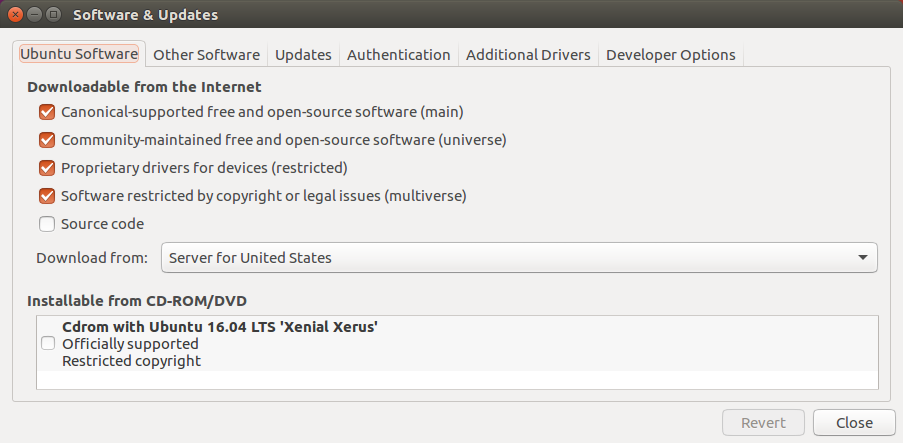

# MMM ROS Integration Documentation

## Introduction
ROS (Robot Operating System) is a popular multipurpose robotics framework used widely in research and industry. It is highly modular, with an architecture based around many "nodes" communicating with each other, and can be used with many different programming languages, notably Python and C++. With an active community surrounding it, it's easy to find support and useful packages to perform many advanced tasks.

We included ROS support for the Multipurpose Mobile Manipulator to encourage its use for advanced robotics research and education. This support is provided in the form of a ROS package called `mmmros`. However, note that most basic applications of ROS can be achieved in pure Python. Please consider your needs before taking the time to delve into ROS.

##### When you should use ROS
- To set up multiple nodes (programs) for complex robotic tasks.
- To use the existing vast collection of ROS libraries with the MMM.
- For advanced computer vision, mapping, and navigation (we do provide a tutorial on how to use the Kinect with the MMM for these purposes).
- You are already comfortable with ROS (If you know what you're doing, clone the library to your catkin workspace, build it, and skip ahead to the API Documentation section.)
- You are already comfortable with Linux systems.
- To more easily produce an asynchronous robot program.

##### When you shouldn't use ROS
- You are an absolute beginner to robotics, programming, or Linux systems.
- You want the robot to follow simple commands or perform one simple task (for example, [these tasks](http://www.instructables.com/id/Multipurpose-Mobile-Manipulator-Mk-1/step70) would typically not need ROS).
- You want to get started with the MMM quickly. ROS takes some time to learn and use effectively.

## ROS Installation and Setup
Before you start, make sure you have the following:

- A fully assembled MMM robot with a programmed Arduino board
- Familiarity with Linux and basic bash commands
- Familiarity with the non-ROS MMM Python library
- A computer with [Ubuntu 16.04 "Xenial Xerus"](http://www.ubuntu.com/download/desktop) installed and one available USB port
    - If you don't have access to a computer that has Ubuntu installed, an Ubuntu virtual machine running on Windows has been tested for most purposes. Using VirtualBox for example, give the guest machine access to the Arduino USB device.
- Add your user to the your system's `dialout` group in order to access USB ports without root privileges: `sudo adduser your_username dialout`

We are using the latest version of ROS, "Kinetic Kame". The official install instructions can be found [here](http://wiki.ros.org/kinetic/Installation/Ubuntu), but there is also a more detailed guide below.

#### Installing ROS
1. Enable the use of "restricted", "universe", and "multiverse" packages by going to Ubuntu System Settings, then the Software & Updates window, and checking the corresponding boxes. They may already be checked.   
  
2. Add the official ROS package repository to your system's list of software sources with the command:  
  `sudo sh -c 'echo "deb http://packages.ros.org/ros/ubuntu $(lsb_release -sc) main" > /etc/apt/sources.list.d/ros-latest.list'`
3. Download the keys for the ROS repository onto your system with the command:  
  `sudo apt-key adv --keyserver hkp://ha.pool.sks-keyservers.net:80 --recv-key 0xB01FA116`
4. Update your local package index:  
  `sudo apt update`
5. Install the Desktop-Full version of ROS, which includes ROS, rqt, rviz, robot-generic libraries, 2D/3D simulators, navigation and 2D/3D perception:  
  `sudo apt install ros-kinetic-desktop-full`
6. Install the MMM Python serial library dependency:  
  `sudo apt install python-serial`
7. If you want to be able to interface with the MMM face, install pyOSC with pip:  
  `sudo apt install python-pip`  
  `sudo pip install pyOSC`

#### Configuring ROS
1. Initialize the rosdep tool:  
  `sudo rosdep init`
2. Update the rosdep database:  
  `rosdep update`
3. Add the ROS environment variables to the .bashrc file in your user folder so that they will be loaded any time you open up a terminal:  
  `echo "source /opt/ros/kinetic/setup.bash" >> ~/.bashrc`
4. Also add them to the current terminal session:  
  `source /opt/ros/kinetic/setup.bash`

#### Setting up the Catkin Workspace
Catkin is the system that ROS uses to manage and automate the build process for your applications. (Even though you may be programming only in Python, the build system is necessary to generate some important ROS resources from your code) The "catkin workspace" is the directory where your development environment and source files will be stored. More information can be found in the [official catkin documentation](http://wiki.ros.org/catkin).

1. Create the folder for your catkin workspace in the root of your user directory:  
  `mkdir -p ~/catkin_ws/src`
2. Navigate to that folder:  
  `cd ~/catkin_ws/src`
3. Initialize the catkin workspace:  
  `catkin_init_workspace`
4. Navigate up:  
  `cd ~/catkin_ws/`
5. Build the project to create a few files/folders and test if everything is properly working:  
  `catkin_make`
6. Add the catkin workspace environment variables to your .bashrc file:  
  `echo "source ~/catkin_ws/devel/setup.bash" >> ~/.bashrc`
7. Also add them to the current terminal session:  
  `source ~/catkin_ws/devel/setup.bash`

#### Getting the `mmmros` package
Now that your catkin workspace is fully set up, you can download the `mmmros` package.

1. Navigate to the source folder:  
  `cd ~/catkin_ws/src`
2. Clone the github repository:  
  `git clone https://github.com/Choitek/mmmros.git`
3. Download the MMM Python library (and optionally the MMM Speaker library) from the [official repository](https://github.com/Choitek/MultipurposeMobileManipulatorMk1/tree/master/Software/Libraries/Python%202.7) and put them in the scripts directry of the `mmmros` package.
3. Mark the files in the scripts directory as executable:  
  `chmod -R +x mmmros/scripts`
4. Navigate up:  
  `cd ~/catkin_ws`
5. Build the package:  
  `catkin_make`

If the package built successfully, you are now ready to begin controlling your MMM through ROS! You should restart your terminal window to reload all of the new variables created.

**Note:** If at any time you want to uninstall ROS and then reinstall it, make sure you do a complete uninstall with `sudo apt-get remove --auto-remove ros-kinetic-*` Otherwise, when you try to run ROS commands, you will get errors such as the absence of `/opt/ros/kinetic/setup.bash`.

## Tutorials
These tutorials will get you on track with the skills to write your own ROS programs and may give you some ideas of where to go next. Before delving straight into programming the MMM, it is highly suggested that you complete the sequence of [ROS beginner tutorials](http://wiki.ros.org/ROS/Tutorials), starting with #2, "[Navigating the ROS Filesystem](http://wiki.ros.org/ROS/Tutorials/NavigatingTheFilesystem)". If you plan on using Python to develop for ROS, it is also worthwhile to look through the [overview of the rospy API](http://wiki.ros.org/rospy/Overview). Finally, you can refer to the MMM API Documentation below while completing these tutorials. Note that it's possible to use C++ with `mmmros` due to the modular nature of ROS, but all provided code and tutorials will be in Python.

1. #### [Writing a teleop node](tutorials/teleop.md)
   Create a program to control the movements of the robot.

2. #### [Using tf](tutorials/tf.md)
   Learn how to use the tf library to give your robot some spatial awareness.

3. #### [Mapping and navigation with the Kinect (SLAM)](tutorials/kinect.md)
   Use the Microsoft Kinect to give your robot vision, mapping, and autonomy capabilities.

[This repository](https://github.com/Choitek/mmmros-tutorials) has the completed packages for all of the tutorials for your reference. You can clone the entire repository into your catkin workspace and build it (`catkin_make`) so all of the tutorials are ready to run.

## API Documentation
Our ROS library operates in a very similar way to the pure Python library (in fact, it uses it as its base), except that it allows for higher-level robotics work in conjunction with other nodes. You are encouraged to look through the well-commented code for the MMM node, located in `mmmros/scripts/mmm_node.py`. It is expected that you are already familiar with the regular MMM Python library.

### What is provided
- A node that takes care of all serial communication to and from the onboard Arduino
- A topic and message type for sending movement commands to the robot (specification below)
- A topic and message type on which sensor data is automatically published to
  - The rate of checking can be altered with a ROS parameter
  - Ultrasonic sensor collection can also be toggled on and off with a ROS parameter
- Communication with the face written in Unity, providing text-to-speech features
- ROS parameters that specify many relevant variables, such as robot dimensions, serial port, and the limiting values of the actuators
- In-depth tutorials and examples

### Nodes
One node is included, named `mmm`. As soon as it starts, it attempts to establish a serial connection with the robot's Arduino board over the specified port. If it cannot connect, the node and the entire ROS stack will exit due to it being specified as a "required" node. As soon as movement command messages are received, they will be clamped to appropriate values and relayed to the Arduino. By default, the node will not collect ultrasonic sensor data, but this capability can be toggled on and off. In the tutorials, you will make other nodes to supplement the `mmm` node

### Messages
Two custom message types are included in the `mmmros` package.

##### Movement commands
The `Movement` message type can be imported from the Python library `mmmros.msg` and has a field for each actuator. The following table shows the values that can be passed into the `mmm/move_commands` topic.

  Part    |       Unit       | Min value | Max value |                            Message field
:-------: | :--------------: | :-------: | :-------: | :------------------------------------------------------------------:
 Wheels   | Speed (meters/s) |   -0.18   |   0.18    |        float64 `leftWheelSpeed`<br>float64 `rightWheelSpeed`
Shoulders | Angle (degrees)  |     0     |    135    |     float64 `leftShoulderAngle`<br>float64 `rightShoulderAngle`
  Elbow   | Angle (degrees)  |    -60    |    60     |        float64 `leftElbowAngle`<br>float64 `rightElbowAngle`
   Arm    | Length (meters)  |     0     |   0.127   |      float64 `leftArmExtension`<br>float64 `rightArmExtension`
Grippers  | Angle (degrees)  |     0     |    180    | float64[5]\* `leftGripperAngles`<br>float64[5]\* `rightGripperAngles`

\* These are arrays of the angles for each finger, use a list or tuple in Python

##### Ultrasonic sensor data
If the capability is turned on, the `mmm/sensor_data` topic contains a stream of messages of type `SensorData` (also imported from the Python library `mmmros.msg`) with fields `leftRange` and `rightRange`, both formatted as int64. These indicate the detected obstacle distance in centimeters.

##### Speaker interface
You can connect to the "face" of MMM (written in the Unity engine) and make it talk over the OSC protocol! Download the face program [here](https://github.com/Choitek/MultipurposeMobileManipulatorMk1/tree/master/Software/Modules/Robot%20Face/). To have it say something, publish a ROS message of type `String` from the `std_msgs` library to the topic `mmm/speaker_msgs`. Enable this capability by setting the parameter `mmm/face/active` to true.

### Topics
- `mmm/move_commands`  
  Publish messages here to make the MMM robot move its actuators.
- `mmm/sensor_data`  
  Subscribe to messages on this topic to receive the ultrasonic sensor data. (If capability is turned on)
- `mmm/speaker_msgs`
  Publish messages here to have them relayed to the "face" to be spoken. (If capability is turned on)

### Parameters
The ROS parameter server is used to keep track of a number of variables that are used in running the `mmm` node or simply provided for your convenience. Modify them in your application's roslaunch file with the `<param>` tag if they need to be changed from their default values. The rospy API allows you to access them inside your Python code, but generally it's best to set them in your roslaunch file. Defaults are set in the

- `mmm/port`  
  Specifies the port over which the `mmm` node will attempt to make a connection to the Arduino.  
  *(default is `"/dev/ttyACM0"`)*

- `mmm/sensor/active`  
  Toggles ultrasonic sensor data collection on and off.  
  *(default is `false`)*

- `mmm/sensor/rate`  
  If the ultrasonic sensor is on, this specifies the rate in Hertz at which readings are requested.  
  *(default is `10`)*

  - `mmm/face/active`  
    Specifies whether the mmm node should listen for messages to send to the Unity "face" over OSC.  
    *(default is false)*

- `mmm/dimensions/...`  
  Specify the various dimensions of the robot in meters for use in the tf tutorial, etc.  
  *(defaults are the dimensions of a typical MMM mark II robot)*
  - `mmm/dimensions/baseToChest`: the height from the ground to the middle of the chest section
  - `mmm/dimensions/chestToShoulder`: the horizontal length from the middle of the chest to the middle of the shoulder joint
  - `mmm/dimensions/shoulderToElbow`: the distance from the middle of the shoulder joint to the middle of the elbow joint
  - `mmm/dimensions/elbowToWrist`: the distance from the middle of the elbow joint to the end of the arm
  - `mmm/dimensions/wheelSeparation`: the length between the wheels
  - `mmm/dimensions/wheelRadius`: the radius of the wheels

- `mmm/ACTUATOR_NAME/min` and `mmm/ACTUATOR_NAME/max`  
  Specifies the minimum and maximum limits of the various actuators in the MMM robot. Replace `ACTUATOR_NAME` with the name of the `move_command` message field to return the limiting values. These are for your use only in limiting the values of sent to the robot. The `mmm` node does clamp down your values, but it has no way of signaling back that this has happened. There is an example of these parameters in use in the [teleop tutorial](tutorials/teleop.md).  
  *(defaults are the actuator limits given in the "Movement commands" table above)*

### Roslaunch
The recommended and easiest way of using the MMM node in your application with the roslaunch tool. In order to have the `mmm` node automatically started and all of the appropriate parameters set, we provide a roslaunch file that can be included in your own. With that in mind, most uses of the `mmmros` library will have a roslaunch file structured like this:

```xml
<launch>
    <include file="$(find mmmros)/launch/mmm.launch"/>
    <param name="mmm/port" value="specify_your_port_here"/>
    <node pkg="package_name" name="node_name" type="node_file_name.py" output="screen"/>
</launch>
```

Note that the `<include>` tag should be placed before any tags setting MMM parameters of your own. If you want to enable the ultrasonic depth sensors or the face, add additional parameters like so:

```xml
<param name="mmm/sensor/active" value="true"/>
<param name="mmm/face/active" value="true"/>
```
