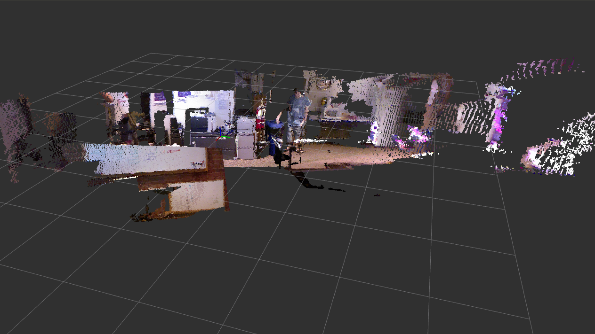

# Kinect Vision, Mapping, and Navigation in ROS
Simultaneous Localization and Mapping (SLAM) is one of the most popular advanced robotics concepts, and many ROS packages make it more than simple to get working. In fact, while this tutorial is the most computationally advanced, it will require writing the least code. You'll see how the reusable packages in the ROS environment can be used together to achieve complex functions. Then we'll set up a basic program for autonomous navigation to keep your robot bouncing around walls.

## Vision
First things first, lets get the Kinect working and sending data through ROS using the libfreenect library. It is integrated into ROS as the package [freenect_stack](http://wiki.ros.org/freenect_stack). This tutorial was made using the original Kinect v1 for Xbox, but it may be possible to use the newer Kinect v2 ("Kinect for Windows") with [libfreenect2](https://github.com/OpenKinect/libfreenect2).

1. Install the libfreenect stack:  
  `sudo apt install ros-kinetic-freenect-stack`
2. Connect the Kinect to your computer and test the Kinect stack by running the convenient launch file (depth registration refers to the pairing of color data with depth points):  
  `roslaunch freenect_launch freenect.launch depth_registration:=true`
3. Open up rviz in a separate terminal window (press `ctrl + shift + T` to open a new terminal tab):  
  `rosrun rviz rviz`
4. In the rviz options panel on the left, change Global Options > Fixed Frame to `camera_link`
5. In rviz add a new PointCloud2. Set its topic to `/camera/depth_registered/points`.
6. Wait a few seconds for the point cloud to show up. You may need to rotate the viewport around to see it.
7. Play around with some of the different topics being sent out by the Kinect.

## Mapping and Localization
Because the MMM robot does not have wheel encoders, as we encountered in the tf tutorial, we will need another method of determining its location in the environment. In the tf tutorial, we made a very basic simulator, but this isn't accurate enough for mapping. Luckily there are other approaches to this problem that involve active localization while 3D mapping. The tool we will use to generate a map of the test space is called [rtabmap](http://wiki.ros.org/rtabmap_ros).

1. Install the rtabmap package for ROS:  
  `sudo apt install ros-kinetic-rtabmap-ros`
2. Due to a bug in rtabmap, you need to specify the location of a particular library by adding a variable to your bash session and restart your terminal:  
  `echo export LD_LIBRARY_PATH=$LD_LIBRARY_PATH:/opt/ros/kinetic/lib/x86_64-linux-gnu >> ~/.bashrc`
3. Start up the Kinect ROS nodes like before:  
  `roslaunch freenect_launch freenect.launch depth_registration:=true`
4. Now start the rtabmap mapping tool. There are 2 optional interfaces, one in rviz and another specific to rtabmap. You can launch the rviz one with this command:  
  `roslaunch rtabmap_ros rgbd_mapping.launch rtabmap_args:="--delete_db_on_start" rviz:=true rtabmapviz:=false`  
  The non-rviz one is launched with this command:  
  `roslaunch rtabmap_ros rgbd_mapping.launch rtabmap_args:="--delete_db_on_start"`
5. Once the imagery loads, move the Kinect around with your hands, and rtabmap will update the position of the camera. If you move the camera too fast, it may lose track of where it is, and you will have to return it to point where it was so it can regain odometry.

Eventually, you might see something like this:



Assuming that those tests worked, we can set up a launch file to start the Kinect, rtabmap, and the teleop node to you can drive the MMM robot around. First, create a new package named `mmm_kinect` and give it a few dependencies, which we'll be using later.
```sh
cd ~/catkin_ws/src/
catkin_create_pkg mmm_kinect rospy freenect_launch freenect_camera sensor_msgs rtabmap_ros cv_bridge
```
Create a launch file named `mapping.launch` in the package and add the following contents
```xml
<launch>
    <include file="$(find mmmros)/launch/mmm.launch"/>
    <param name="mmm/port" value="/dev/ttyACM0"/>

    <include file="$(find freenect_launch)/launch/freenect.launch">
        <arg name="depth_registration" value="true"/>
    </include>

    <include file="$(find rtabmap_ros)/launch/rgbd_mapping.launch">
        <arg name="rtabmap_args" value="--delete_db_on_start"/>
        <arg name="rviz" value="true"/>
        <arg name="rtabmapviz" value="false"/>
    </include>

    <node pkg="mmm_teleop" name="mmm_teleop" type="teleop_node.py" output="screen"/>
</launch>
```
Launch it with `roslaunch mmm_kinect mapping.launch` and drive the robot around to build up the map!

## Autonomous Navigation
To get started in the world of robot navigation, we'll write a very simple python ROS node to have the robot bounce around walls. Using depth data from the Kinect, it will keep driving straight until it sees an obstacle, at which point it will turn until the obstacle is no longer in the way and keep on driving. This could be useful for autonomously mapping a room, but keep in mind that the Kinect's power cord is an issue that you'll have to work around. There are tutorials online for hacking the Kinect's power supply so it can run off of your robot's batteries and be more mobile. We won't cover that here, but be aware that it requires destroying a Kinect power supply and potentially some additional hardware.

We'll need some basic OpenCV functions to read Kinect images with Python, so install the appropriate ROS package with `sudo apt install ros-kinetic-cv-bridge`. Create a new Python script called `autonav_node.py` in the `mmm_kinect` package and mark it executable with `chmod +x autonav_node.py`. As always, start with the shebang line and import some libraries.

```py
#!/usr/bin/env python
from __future__ import division
import rospy
from mmmros.msg import Movement
from sensor_msgs.msg import Image
import cv2
from cv_bridge import CvBridge
import numpy as np
import random
import threading
```

Most of these libraries will help us convert a ROS Image message to an OpenCV image and then perform some numpy calculations on it. Create a class and initializer method for the node.

```py
class AutonavNode(object):
    def __init__(self):
```

Set a few variables for controlling the speed and minimum obstacle distance that the robot will approach. A good starting minimum distance is half a meter, but feel free to tune that appropriately. We want the speed to be slow enough to avoid damage and also to give rtabmap the time it needs to track the pose of the robot. The variable `self.avoiding` will be a loop guard that signals when to start and stop turning the robot in order to avoid obstacles.

```py
self.min_distance = 500 #millimeters
self.speed = rospy.get_param("mmm/leftWheelSpeed/max")/2
self.avoiding = False
```

Initialize the node and create an instance of the Kinect-OpenCV interchange object.

```py
rospy.init_node("autonav_node")
self.cv_bridge = CvBridge()
```

Add the subscriber for Kinect images and the publisher for MMM movement commands. The execution should sleep for 4 seconds to allow the MMM node to start up, and then give an initial forward movement command. `rospy.spin()` will ensure that the node doesn't exit before it is closed.

```py
# Create subscriber for Kinect images
self.sub = rospy.Subscriber("camera/depth_registered/image_raw", Image, self.process_depth_image)
# Create publisher for movement commands
self.pub = rospy.Publisher("mmm/move_commands", Movement, queue_size=1)
# Allow MMM node to start
rospy.sleep(4)
# Start moving forward initially
self.pub.publish(Movement(leftWheelSpeed=self.speed, rightWheelSpeed=self.speed))
rospy.spin()
```

Now we'll write the callback method for the Kinect depth image subscriber. The `imgmsg_to_cv2` method will take the entire image message and convert it to a numpy matrix. For speed, we'll use some numpy magic to find the minimum value in the depth image, and therefore the distance to the closest obstacle. To do this, we first find all nonzero elements of the image (since 0 is used to signify no depth data) and then find the minimum value from the remaining elements. Numpy operations are very optimized and are much faster than looping through the entire image to find the minimum value. If the `min_point` is closer than the smallest allowed distance and the robot is not already avoiding a different obstacle, then we start the `avoid_obstacle` method in a new thread. If the `min_point` is far enough away, we set `self.avoiding` back to False to tell the `avoid_obstacle` method to give up control.

```py
def process_depth_image(self, msg):
    im = self.cv_bridge.imgmsg_to_cv2(msg)
    min_point = im[im.nonzero()].min()
    print(min_point)
    if min_point < self.min_distance:
        if not self.avoiding:
            threading.Thread(target=self.avoid_obstacle).start()
    else:
        self.avoiding = False
```

Now let's write the `avoid_obstacle` method. Set `self.avoiding` to True so that the `process_depth_image` method knows not to call `avoid_obstacle` again. Then begin a right turn movement (or left if you want). An indefinite while loop will act until the robot is facing a safe direction and `self.avoiding` is set to False again. We'll check for that at an interval of 30 hertz. Once the loop has exited, the path is clear and you can send a forward movement command again.

```py
def avoid_obstacle(self):
    print("AVOIDING")
    self.avoiding = True
    self.pub.publish(Movement(leftWheelSpeed=self.speed, rightWheelSpeed=-self.speed))
    while self.avoiding:
        rospy.sleep(1/30)
    self.pub.publish(Movement(leftWheelSpeed=self.speed, rightWheelSpeed=self.speed))
    print("DONE AVOIDING")
```

Finally, to run the main node function:

```py
if __name__ == '__main__':
    autonav_node = AutonavNode()
```

Now you're ready to let your MMM autonomously map a room! The best location for the Kinect is usually on top of the chest, in front of the laptop. Keep an eye on the power cables so nothing falls! Start up the mapping launch file (`roslaunch mmm_kinect mapping.launch`) and in a separate terminal run the "autonav" script with `rosrun mmm_kinect autonav_node.py`. If you want, you can also add an extra line to `mapping.launch` to automate this:

```xml
<node pkg="mmm_kinect" name="autonav_node" type="autonav_node.py" output="screen"/>
```


## Where to go next
- Make use of the [ROS navigation stack](http://wiki.ros.org/navigation) to set waypoints for your robot
- Set up 2D mapping with [gmapping](http://wiki.ros.org/gmapping) and [depthimage_to_laserscan](http://wiki.ros.org/depthimage_to_laserscan) and 2D localization with [amcl](http://wiki.ros.org/amcl).

[Completed tutorial files]() **TODO: add link to completed tutorial**
