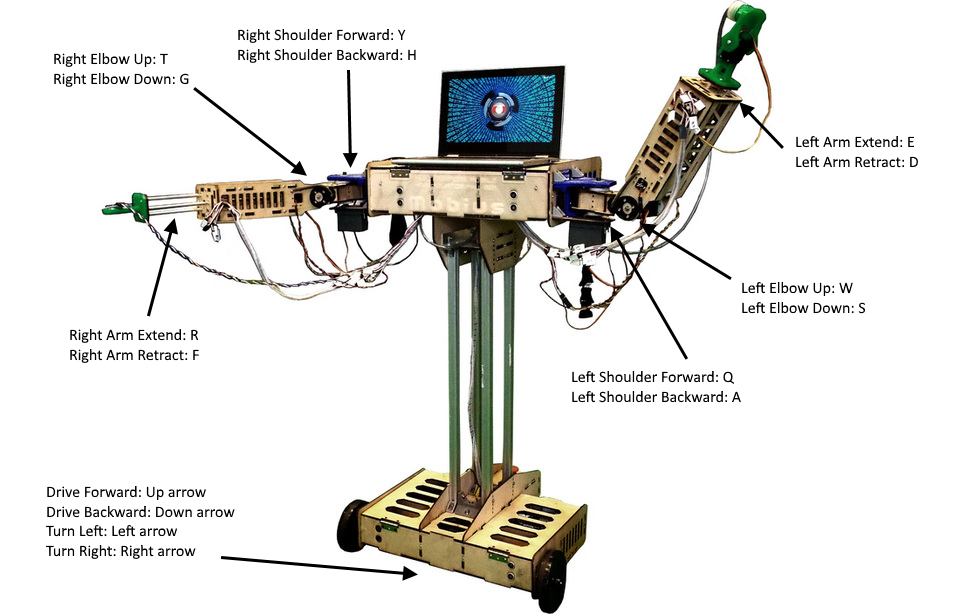

# Tutorial: Writing a teleop node
This tutorial will get you fully acquainted with the operation of the most important parts of ROS and the MMM library. This will not be actual teleoperation since you will probably run it on the same computer that is connected to the MMM, but since ROS is a distributed network, you could theoretically run the teleop node on a different computer from the MMM node. If you wish to learn more about this capability, check out [the multiple machines tutorial](http://wiki.ros.org/ROS/Tutorials/MultipleMachines).

We will be using the Tkinter GUI library included in Python to make an application that allows the user to control all of the main joints and actuators on the MMM robot (excluding the grippers) with their keyboard. The standard library for GUI creation in ROS is actually Qt, but that would require an introduction to an entirely new framework. Python programmers may be more familiar with Tkinter, which is also more straightforward. We'll also have the program display the ultrasonic sensor values. It will be a simple program, but the goal is to demonstrate the total control and flexibility available with ROS.

### Creating the ROS node
Create a new package named `mmm_teleop` and give it rospy as a dependency.

```sh
cd ~/catkin_ws/src/
catkin_create_pkg mmm_teleop rospy
```

Then create a file in the `mmm_teleop` directory named `teleop_node.py`. You'll need to mark the `teleop_node.py` file as executable, which can easily be done in the Permissions tab of the file properties menu or with the console command `chmod +x teleop_node.py`. This should be done with all scripts that you plan to directly run in ROS.


On Linux systems, always begin your executable Python scripts with a declaration of the interpreter that will be used. In this case, we'll use the default Python interpreter included in Ubuntu. In Ubuntu 16.04, this is Python 2.7.

```py
#!/usr/bin/env python
```

Next we need to import all the necessary libraries.

```py
from __future__ import division
import rospy
import os
from Tkinter import *
from mmmros.msg import Movement, SensorData
```

We are importing the new division function from the `__future__` package so that division works as expected. The rospy library is the interface to all of the available ROS functionalities. The `os` import will be useful later. All functions and classes should be imported from `Tkinter`. Finally, we need to import the provided MMM message classes from the `mmmros` package since we will use them to send movement commands and receive sensor data. In order to import it, the `mmmros` package only needs to be built once to auto-generate the Python libraries for the custom message types. You have probably already done this in the installation section.

To begin with the user interface, we will create a class `ControlApp` that inherits from the base `Tk` class.

```py
class ControlApp(Tk, object):

    def __init__(self):
        super(ControlApp, self).__init__()
```

Still in the `__init__` function, we'll set some of the parameters that will be used for control. The program will only have one speed for each type of actuator (wheels, angular, and arms) and it will use them to set a delay to increment or decrement the angle being written to the actuator. The wheels can simply take a speed value and will move automatically, but to produce smooth movement in the other actuators, we need to gradually change them while a button is held down. The amount that they will be incremented will be the approximate resolution of motion. Here are some good values to start with.

```py
self.wheelSpeed = 0.18  # meters/s
self.angularSpeed = 10  # degrees/s
self.angularResolution = 1  # degree
self.armSpeed = 0.01  # meters/s
self.armResolution = 0.001 # meters
```

We will keep track of the position of the robot with an new `Movement` message full of default values (all 0) since a message type can be used internally in Python to store data as well. This will make it easy to update the `state` object and then publish it to the `mmm` node to synch up the robot. The `moving` attribute will be used to turn repeats on and off.

```py
self.state = Movement()
self.moving = False
```

You probably remember from the [ROS tutorials](http://wiki.ros.org/ROS/Tutorials/WritingPublisherSubscriber(python)) the methods for initializing a node, creating a publisher, and a subscriber.

```py
# Initialize the teleop node
rospy.init_node("teleop")
# Create the publisher object for sending movement commands to the mmm node
self.pub = rospy.Publisher("mmm/move_commands", Movement, queue_size=1)
# Create the subscriber object for receiving sensor data
self.sub = rospy.Subscriber("mmm/sensor_data", SensorData, self.display_sensor_data)
```

We now have a node that publishes movement commands to the `mmm/move_commands` topic and subscribes to sensor data on the `mmm/sensor_data` topic. Note that the publisher queue size is 1, which means that old messages will be kicked off very quickly to make way for new ones, which is a good method for control of our types of actuators.

### Interface
Now we'll make a very simple Tkinter interface to gather keyboard input and show sensor data. Since the `ControlApp` class inherits from the `Tk` class, we can call a number of methods on `self`. First, we set the window to a reasonable size. we bind `KeyPress` and `KeyRelease` events to the `keydown` and `keyup` methods, respectively. Those methods will be written later. Then in order to display the sensor values in the Tkinter window, we need to make a `StringVar` (part of Tkinter) to hold the text and a `Label` to display it. The Label widget can be placed into the window with the `pack` method. Finally, to show the window and start event handling, the `mainloop` method needs to be called. Still in the `__init__` method, add the following:

```py
self.geometry("100x100")
self.bind("<KeyPress>", self.keydown)
self.bind("<KeyRelease>", self.keyup)
self.sensorText = StringVar()
self.sensorLabel = Label(self, textvariable=self.sensorText)
self.sensorLabel.pack()
self.mainloop()
```

Before moving on to the keyboard control, we'll write the callback function to display sensor data. This will also be a method inside the `ControlApp` class. The `msg` argument is automatically passed in by the rospy subscriber we created earlier. Then build a string containing the left and right sensor values, which can be accessed as attributes of the `msg` object. The Tkinter label StringVar can be updated with the `set` method.

```py
def display_sensor_data(self, msg):
    s = "Left: " + str(msg.leftRange) + "\nRight: " + str(msg.rightRange)
    self.sensorText.set(s)
```

### Keyboard Control
Next we will write the `keydown` method. The control scheme is as indicated in the picture below (although you are free to change it around).



The `keydown` function will automatically be passed the `event` argument by Tkinter. The identity of the key that was pressed is contained in the `event.keysym` attribute and we will perform different actions based on the key pressed. In the case of wheel controls, the wheel speeds can simply be set in the `self.state` variable, and then that state message published to the movement commands topic. In the case of actuators that need to be constantly updated, we will refer to another function that will be written later, `move`. Into this move function, we'll pass in the name of the message field that will be updated (as a string, which will be explained soon), the amount of incrementation, and the speed of movement, which will be used to calculate a time delay for the repeat. Note that we only want to update a continuous actuator if there is not already one moving, specified by the value of `self.moving`.

```py
def keydown(self, event):
    # On/off actuators
    if event.keysym == "Up":
        self.state.leftWheelSpeed = self.wheelSpeed
        self.state.rightWheelSpeed = self.wheelSpeed
        self.pub.publish(self.state)
    elif event.keysym == "Down":
        self.state.leftWheelSpeed = -self.wheelSpeed
        self.state.rightWheelSpeed = -self.wheelSpeed
        self.pub.publish(self.state)
    elif event.keysym == "Left":
        self.state.leftWheelSpeed = -self.wheelSpeed
        self.state.rightWheelSpeed = self.wheelSpeed
        self.pub.publish(self.state)
    elif event.keysym == "Right":
        self.state.leftWheelSpeed = self.wheelSpeed
        self.state.rightWheelSpeed = -self.wheelSpeed
        self.pub.publish(self.state)
    # Continuous actuators
    if not self.moving:
        self.moving = True
        # SHOULDERS
        if event.keysym == "q":
            self.move("leftShoulderAngle", +self.angularResolution, self.angularSpeed)
        elif event.keysym == "a":
            self.move("leftShoulderAngle", -self.angularResolution, self.angularSpeed)
        elif event.keysym == "y":
            self.move("rightShoulderAngle", +self.angularResolution, self.angularSpeed)
        elif event.keysym == "h":
            self.move("rightShoulderAngle", -self.angularResolution, self.angularSpeed)
        # ELBOWS
        elif event.keysym == "w":
            self.move("leftElbowAngle", +self.angularResolution, self.angularSpeed)
        elif event.keysym == "s":
            self.move("leftElbowAngle", -self.angularResolution, self.angularSpeed)
        elif event.keysym == "t":
            self.move("rightElbowAngle", +self.angularResolution, self.angularSpeed)
        elif event.keysym == "g":
            self.move("rightElbowAngle", -self.angularResolution, self.angularSpeed)
        # ARMS
        elif event.keysym == "e":
            self.move("leftArmExtension", +self.armResolution, self.armSpeed)
        elif event.keysym == "d":
            self.move("leftArmExtension", -self.armResolution, self.armSpeed)
        elif event.keysym == "r":
            self.move("rightArmExtension", +self.armResolution, self.armSpeed)
        elif event.keysym == "f":
            self.move("rightArmExtension", -self.armResolution, self.armSpeed)
```

The `move` method is designed to be very multipurpose, so we will used some more complicated techniques to avoid writing 12 different functions for the different actuators, which Python makes fairly easy. The function is guarded by the condition that an actuator is supposed to be moving (`self.moving`) and the limits of the actuators themselves. Here we use the ROS parameter server to obtain the minimum and maximum actuator positions and see if the `move` method will bring the actuator into a valid position. The next line of the function is equivalent to `self.state.part += amount`, but since `part` is passed in as a string, we will use the `setattr` and `getattr` functions to do this. These functions allow you to modify an attribute of an object by passing in the name of the attribute as a string, which is perfect for our uses! Then a simple publish command sends the updated state message to the robot node. Finally, we want this function to be repeatedly called while the right key is held down. To do this, Tkinter provides the `after` method that allows you to specify a delay after which a certain function will be called. The delay is calculated as the incrementation divided by the desired movement speed in milliseconds. The arguments for `move` are also passed in after the name of the function to be called. We will store this task in the `self.repeat` variable so that it can be cancelled as soon as the key is released.

```py
def move(self, part, amount, speed):
    minval = rospy.get_param("mmm/" + part + "/min")
    maxval = rospy.get_param("mmm/" + part + "/max")
    if self.moving and minval <= getattr(self.state, part) + amount <= maxval:
        setattr(self.state, part, getattr(self.state, part) + amount)
        self.pub.publish(self.state)
        self.after(int(abs(amount / speed) * 1000), self.move, part, amount, speed)
```

When a key is released, we would like the robot to stop all motion. In the case of wheel movement, just set the wheel speed to 0 and publish that command, but for other actuators, we set `self.moving` to `False` to prevent the `move` method from running.

```py
def keyup(self, event):
    if event.keysym in ["Up", "Down", "Left", "Right"]:
        self.state.leftWheelSpeed = 0
        self.state.rightWheelSpeed = 0
        self.pub.publish(self.state)
    elif event.keysym in ["q", "a", "w", "s", "e", "d", "r", "f", "t", "g", "y", "h"]:
        self.moving = False
```

One final tweak remains to get this program running, and that is to disable the Linux system's key repeat feature, which quickly turns on and off a keyboard input while it is held down. This is sometimes useful for typing, but it also interferes with the program's function, so it can be turned off with the `os` library as shown below. Then instantiate a `ControlApp` object to start the Tkinter program and the ROS node. Also, remember to turn key repeat back on after the program finishes! Write the following outside the `ControlApp` class.

```py
if __name__ == '__main__':
    os.system('xset r off')
    control = ControlApp()
    os.system('xset r on')
```

### Running the program
The best way to run the program is with a roslaunch file. You can read more about launch files in the main documentation, but our file `teleop.launch`, which you should place in the `mmm_teleop` package, will contain the following:

```xml
<launch>
    <include file="$(find mmmros)/launch/mmm.launch"/>
    <param name="mmm/port" value="/dev/ttyACM0"/>
    <param name="mmm/sensor/active" value="true"/>
    <node pkg="mmm_teleop" name="teleop" type="teleop_node.py" output="screen"/>
</launch>
```

Since the program doesn't contain anything that needs to be built or generated, it is not necessary to run `catkin_make`. Just run the launch file!

```sh
roslaunch mmm_teleop teleop.launch
```

*With the Tkinter window in focus*, you can enter any of the specified keys and the robot's actuators will move. The program is very basic and doesn't have a lot of robustness to multiple key commands, so be careful pressing multiple keys at the same. Have fun controlling the motions of your MMM robot with your keyboard!

[Completed tutorial files]() **TODO: add link to completed tutorial**
