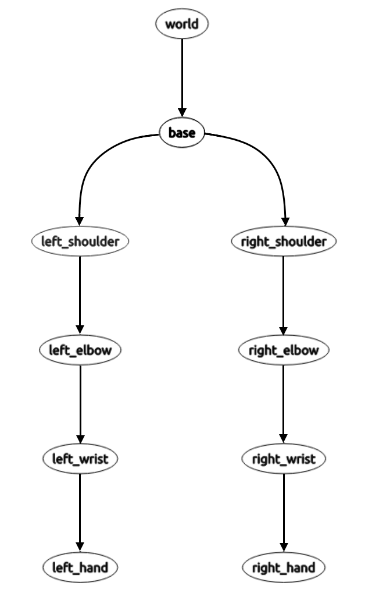
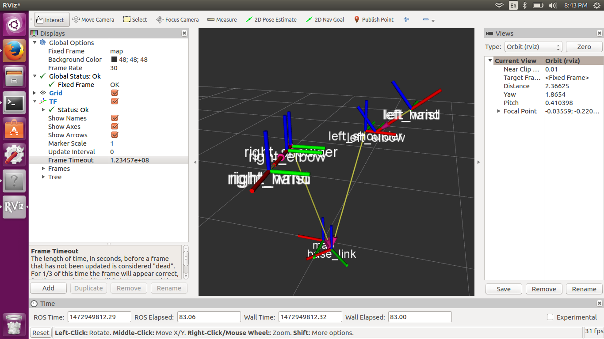

# Tutorial: Using tf
In this tutorial you will learn about how to use the tf library to give your robot some spatial awareness. It may help to complete the [official ROS tf tutorials](http://wiki.ros.org/tf/Tutorials).

Let's say you want to keep track of where your robot is in 3D space. It would be pretty easy to set up a topic for relaying this position data and a node that keeps track of the wheel velocity to update its position. But what if you also wanted to know where the arms were? The tf library will allow you to keep track of the positions all of the joints through a system of relative transformations organized like a tree. That way, when the shoulder angle is adjusted, the position of the arm and hand are also updated. There are more advanced functions that are capable with tf, such as looking up transforms at certain times in the past, but this tutorial will focus on basic transform sending and lookup. We will combine the teleop program from the [previous tutorial](./teleop.md) with the Rviz tool to allow control and visualization of the tf tree. You should end up with a system that mirrors the Movement commands sent out by the teleop node (and therefore also the physical robot).

Create a new package named `mmm_tf` and give it rospy and tf as a dependency.

```sh
cd ~/catkin_ws/src/
catkin_create_pkg mmm_tf rospy tf
```

Then create a file in the `mmm_tf` directory named `tf_node.py`. You'll need to mark the `tf_node.py` file as executable, which can easily be done in the Permissions tab of the file properties menu or with the console command `chmod +x tf_node.py`.

Like last time, begin your program with a shebang line and import the following libraries.

```py
#!/usr/bin/env python
from __future__ import division
import rospy
import tf
import threading
from math import radians, cos, sin, pi
from mmmros.msg import Movement
```

Since we'll need to convert orientations between quaternions and Euler angles (ROS default is quaternions), make some convenient aliases to the conversion functions included in the tf transformations library.

```py
quaternion = tf.transformations.quaternion_from_euler
euler = tf.transformations.euler_from_quaternion
```
Using object-oriented programming will keep things organized and efficient. Make a class and an initializer function.

```py
class TFNode(object):
    def __init__(self):
```

In general we want to centralize most of the real number specifications to the main config file (`mmm.yaml` in mmmros/config). `mmm.yaml` is distributed with the default dimensions of the MMM, but you may modify them to fit your needs. Let's now import them into variables in `__init__` function.

```py
self.baseToChest = rospy.get_param("mmm/dimensions/baseToChest")
self.chestToShoulder = rospy.get_param("mmm/dimensions/chestToShoulder")
self.shoulderToElbow = rospy.get_param("mmm/dimensions/shoulderToElbow")
self.elbowToWrist = rospy.get_param("mmm/dimensions/elbowToWrist")
```

tf allows the specification of a tree of transformations between different frames. For this robot, we will have each joint be a different frame. Here is a list of the frames that will be used:
- map (defines the absolute reference point for all other frames)
- base_link (the point on the ground below the middle of the robot)
- shoulders (at the shoulder servo joint)
- elbows (at the elbow servo joint)
- wrists (at the end of the arms)
- hands (at the end of the arms' extending sections)



There are also a few coordinate conventions to keep in mind. They will be important in getting the transformation and rotation math right.
- +y forward
- +x to the right
- +z up
- Angles: rotation about x, y, z axes: pitch, roll, yaw

Unlike the teleop program, in this tf program the arms and other joints are the easy part, and the wheels are the hard part. This is because every time the joints are updated, a new Movement message is sent out and this message can simply be passed into the tf transform system to update the joint transforms. However for the wheels, a Movement message is sent only on starting and stopping the wheel motors, so in order to constantly update the tf tree with the position of the entire robot due to wheel motion, we need to set up a guarded while loop like we did for the joints in the teleop tutorial. Set a variable `self.moving` for telling the loop when to stop.

```py
self.moving = False
```

Continuing in the `__init__` function, we initialize the node and create a tf broadcaster and listener (kind of similar to a publisher and subscriber).

```py
rospy.init_node("mmm_tf")
self.br = tf.TransformBroadcaster()
self.ls = tf.TransformListener()
```

We will need a subscriber to the Movement commands being published by the teleop node. To initialize the tf tree, send an initial map-to-base_link transform, and then an entire empty transform for the whole body. The sleeps are necessary to allow the tf system to get up and running.

```py
self.sub = rospy.Subscriber("mmm/move_commands", Movement, self.sendTransforms)
rospy.sleep(1)
self.br.sendTransform((0,0,0), (0,0,0,1), rospy.Time.now(), "base_link", "map")
rospy.sleep(1)
self.sendTransforms(Movement())
rospy.spin()
```

Let's define the callback method for when the tf node picks up a Movement message sent by the teleop node. Record the current time into a variable `t` so that the batch of transforms from a message can be synchronized (tf is fairly sensitive to time, as this is related to some important advanced features of the library).

```py
def sendTransforms(self, msg):
    t = rospy.Time.now()
```

Adding to the `sendTransforms` method, we'll define how the `base_link` and `map` frames relate. If any of the wheels are moving, we'll start a new thread to hold the while loop to continuously update the transformations. This `moveWheels` method will be written later, but we need to pass into it the Movement message and the current time. The second case is if the wheels are stopped or any other joint is being moved. In this case, we use the tf listener `ls` to look up the current transform (indicated by passing `rospy.Time(0)`) and simply re-sending it with the `bf` broadcaster. The entire tree must be updated, even if there were no Movement updates, because the timestamps on the transforms need to be updated. Note the switched order of the frame arguments in the lookup and send transform functions.

```py
# Map -> base
if msg.leftWheelSpeed != 0 or msg.rightWheelSpeed != 0:
    self.moving = True
    threading.Thread(target=self.moveWheels, args=(msg, t)).start()
if msg.leftWheelSpeed == 0 and msg.rightWheelSpeed == 0:
    self.moving = False
    trans, rot = self.ls.lookupTransform("map", "base_link", rospy.Time(0))
    self.br.sendTransform(trans, rot, t, "base_link", "map")
```

Continuing the `sendTransforms` method, the rest of the joint transforms are fairly simple, but do require a bit of math. Take some time to understand the translation and rotation arguments for the different type of joints (rotating and extending). Also note that (0,0,0,1) is the identity quaternion and results in no rotation. Because the left and right shoulders are mirrored, we need to make the translation x component negative and subtract the yaw rotation angle from 180 degrees. This is only necessary for the shoulders because mirroring is carried down through the tree hierarchy.

```py
# Base -> shoulder
self.br.sendTransform((-self.chestToShoulder,0,self.baseToChest), quaternion(0,0,radians(180-msg.leftShoulderAngle)), t, "left_shoulder", "base_link")
self.br.sendTransform((self.chestToShoulder,0,self.baseToChest), quaternion(0,0,radians(msg.rightShoulderAngle)), t, "right_shoulder","base_link")
# Shoulder -> elbow
self.br.sendTransform((self.shoulderToElbow,0,0), quaternion(0,-radians(msg.leftElbowAngle),0), t, "left_elbow", "left_shoulder")
self.br.sendTransform((self.shoulderToElbow,0,0), quaternion(0,-radians(msg.rightElbowAngle),0), t, "right_elbow", "right_shoulder")
# Elbow -> wrist
self.br.sendTransform((self.elbowToWrist,0,0), (0,0,0,1), t, "left_wrist", "left_elbow")
self.br.sendTransform((self.elbowToWrist,0,0), (0,0,0,1), t, "right_wrist", "right_elbow")
# Wrist -> hand
self.br.sendTransform((msg.leftArmExtension,0,0), (0,0,0,1), t, "left_hand", "left_wrist")
self.br.sendTransform((msg.rightArmExtension,0,0), (0,0,0,1), t, "right_hand", "right_wrist")
```

Now switch to writing the `moveWheels` method mentioned earlier. The variable `checkDelay` is to control the speed of the loop, and 20 Hz is a good starting point. A while loop is guarded by the `self.moving` variable we initialized earlier. Then we look up the most recent map-to-base transform and extract the relevant information, which is the rotation of the robot yaw-wise, and the x and y position.

```py
def moveWheels(self, msg, t):
    checkDelay = 1 / 20
    while self.moving:
        trans, rot = self.ls.lookupTransform("map", "base_link", rospy.Time(0))
        angle = euler(rot)[2]
        x = trans[0]
        y = trans[1]
```

This is followed by four cases inside the while loop, depending on the type of motion. For forward and backward motion, the incremental motion is calculated by the speed * dt and also depends on the orientation. Add pi/2 (90 degrees) to the angle so that the robot moves in the correct direction. For left and right rotation (from the perspective of the robot), the angular speed is approximated by the linear wheel speed divided by the approximate radius from base to wheel, the `chestToShoulder` distance. The angle increment is also calculated by the speed * dt. Finally, we broadcast the updated transform, keeping only the x, y, and yaw components. The loop sleeps for the rest of the `checkDelay` period.

```py
# Forward
if msg.leftWheelSpeed > 0 and msg.rightWheelSpeed > 0:
    x += msg.leftWheelSpeed * checkDelay * cos(angle+pi/2)
    y += msg.leftWheelSpeed * checkDelay * sin(angle+pi/2)
# Backward
if msg.leftWheelSpeed < 0 and msg.rightWheelSpeed < 0:
    x += msg.leftWheelSpeed * checkDelay * cos(angle+pi/2)
    y += msg.leftWheelSpeed * checkDelay * sin(angle+pi/2)
# Rotate Left
if msg.leftWheelSpeed < 0 and msg.rightWheelSpeed > 0:
    angularSpeed = msg.leftWheelSpeed / self.chestToShoulder
    angle += angularSpeed * checkDelay
# Rotate Right
if msg.leftWheelSpeed > 0 and msg.rightWheelSpeed < 0:
    angularSpeed = msg.leftWheelSpeed / self.chestToShoulder
    angle += angularSpeed * checkDelay
self.br.sendTransform((x,y,0), quaternion(0,0,angle), t, "base_link", "map")
rospy.sleep(checkDelay)
```

The node class is done, and to run the main function, add this code at the end:

```py
if __name__ == '__main__':
    tf_node = TFNode()
```

Again we'll run the program with a roslaunch file. This makes it convenient to start up all 4 nodes, the main MMM node, the tf node, the teleop node, and the Rviz tool. Create `tf.launch` under the `mmm_tf` package, containing the following:

```xml
<launch>
    <include file="$(find mmmros)/launch/mmm.launch"/>
    <param name="mmm/port" value="/dev/ttyACM0"/>
    <node pkg="mmm_tf" name="tf_node" type="tf_node.py" output="screen"/>
    <node pkg="mmm_teleop" name="teleop_node" type="teleop_node.py" output="screen"/>
    <node pkg="rviz" name="rviz" type="rviz" args="-d $(find mmm_tf)/tf.rviz"/>
</launch>
```

Now run the launch file!

```sh
roslaunch mmm_tf tf.launch
```

Allow Rviz to load, click on the Add button in the toolbar on the lower left, and add a TF visualization. Then operate the teleop tool as you normally would. You should see the Rviz tf diagrams responding and mirroring the actual robot!



[Completed tutorial files]() **TODO: add link to completed tutorial**
